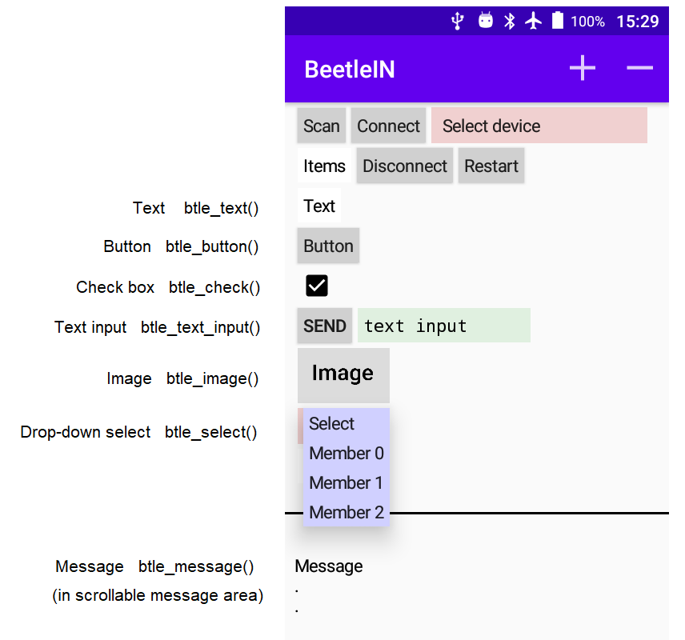
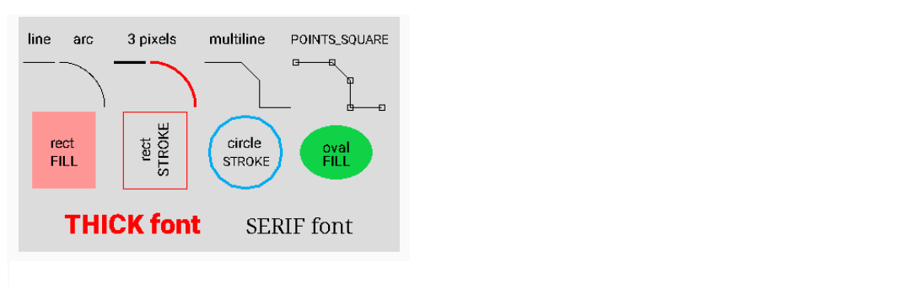

BeetleIN Python and C servers
==================================

*Version 1*

## Contents
- [1 Introduction](#1-introduction)
- [2 Get Started](#2-get-started)
    - [2.1 Downloads](#2-1-downloads)
    - [2.2 Hello World](#2-2-hello-world)
- [3 Writing code](#3-writing-code)
    - [3.1 Template files](#3-1-template-files)
    - [3.2 Program structure and flow](#3-2-program-structure-and-flow)
    - [3.3 Touch screen items](#3-3-touch-screen-items) 
    - [3.4 Item handles](#3-4-item-handles) 
    - [3.5 Connections](#3-5-connections) 
    - [3.6 Master-Slave mode](#3-6-master-slave-mode)
- [4 Library Reference](#4-library-reference) 
    - [4.1 Function list](#4-1-function-list)
    - [4.2 Functions](#4-2-functions)    
        - [4.2.1 btle\_address](#4-2-1-btle\_address)
        - [4.2.2 btle\_broadcast](#4-2-2-btle\_broadcast)       
        - [4.2.3 btle\_button](#4-2-3-btle\_button)
        - [4.2.4 btle\_change\_check](#4-2-4-btle\_change\_check)
        - [4.2.5 btle\_change\_colour](#4-2-5-btle\_change\_colour)
        - [4.2.6 btle\_change\_font](#4-2-6-btle\_change\_font)
        - [4.2.7 btle\_change\_text](#4-2-7-btle\_change\_text)
        - [4.2.8 btle\_check](#4-2-8-btle\_check)
        - [4.2.9 btle\_clear](#4-2-9-btle\_clear)
        - [4.2.10 btle\_connected](#4-2-10-btle\_connected)
        - [4.2.11 btle\_connect\_settings](#4-2-11-btle\_connect\_settings)
        - [4.2.12 btle\_disconnect](#4-2-12-btle\_disconnect)
        - [4.2.13 btle\_font](#4-2-13-btle\_font)
        - [4.2.14 btle\_handles](#4-2-14-btle\_handles)
        - [4.2.15 btle\_image](#4-2-15-btle\_image)
        - [4.2.16 btle\_image\_arc](#4-2-16-btle\_image\_arc)
        - [4.2.17 btle\_image\_circle](#4-2-17-btle\_image\_circle)
        - [4.2.18 btle\_image\_clear](#4-2-18-btle\_image\_clear)
        - [4.2.19 btle\_image\_line](#4-2-19-btle\_image\_line)
        - [4.2.20 btle\_image\_multiline](#4-2-20-btle\_image\_multiline)
        - [4.2.21 btle\_image\_oval](#4-2-21-btle\_image\_oval)
        - [4.2.22 btle\_image\_rect](#4-2-22-btle\_image\_rect)
        - [4.2.23 btle\_image\_text](#4-2-23-btle\_image\_text)
        - [4.2.24 btle\_local\_address](#4-2-24-btle\_local\_address)
        - [4.2.25 btle\_local\_name](#4-2-25-btle\_local\_name)
        - [4.2.26 btle\_maxdevice](#4-2-26-btle\_maxdevice)
        - [4.2.27 btle\_message](#4-2-27-btle\_message)
        - [4.2.28 btle\_message\_buffer](#4-2-28-btle\_message\_buffer)
        - [4.2.29 btle\_name](#4-2-29-btle\_name)
        - [4.2.30 btle\_newline](#4-2-30-btle\_newline)
        - [4.2.31 btle\_password](#4-2-31-btle\_password)
        - [4.2.32 btle\_remove](#4-2-32-btle\_remove)
        - [4.2.33 btle\_restore](#4-2-33-btle\_restore)           
        - [4.2.34 btle\_scale\_data](#4-2-34-btle\_scale\_data)
        - [4.2.35 btle\_select](#4-2-35-btle\_select)
        - [4.2.36 btle\_server](#4-2-36-btle\_server)
        - [4.2.37 btle\_slave](#4-2-37-btle\_slave)
        - [4.2.38 btle\_spacings](#4-2-38-btle\_spacings)        
        - [4.2.39 btle\_text](#4-2-39-btle\_text)
        - [4.2.40 btle\_text\_input](#4-2-40-btle\_text\_input)
        - [4.2.41 btle\_timer](#4-2-41-btle\_timer)


        
## 1 Introduction

BeetleIN is a simple way of using an Android phone or tablet as a touch screen input/output device
for a Raspberry Pi without doing any Android programming. All the coding is done on the
Raspberry Pi in Python or C. The connection is made from the Android device via Bluetooth LE.

There are two components: the BeetleIN Android 
app available from the Google Play Store (*** NOT AVAILABLE YET ***), and server code that runs
on the Pi and waits for Android devices to connect.
This repository contains the server library and full documentation showing how to write
your own code.

Here is a simple example, showing how a couple of Python instructions set up clickable buttons
on an Android screen, and how button clicks are returned to the Pi.


Other instructions set up drop-down selection lists, check boxes, text input boxes, or
send text and graphics to the Android for display. So the Android can be used as a touch-screen input
device, an output screen, or a mixture of both.

One Pi can be connected by multiple Android devices simultaneously and run the same code or 
different code on each. When used in this way, BeetleIN is effectively a miniature
multitasking GUI. On the other hand, one Android device can connect to multiple
Pis simultaneously, and they can each be running a different process.
Switching the Android screen from one Pi to another is done with a single tap. The
Android can address each Pi individually, or broadcast instructions to all the Pis.
Because it allows multiple connections in both directions, BeetleIN
can be used to manage a network of Androids or Pis. 

BeetleIN can potentially replace the Pi's keyboard, mouse and screen, so the Pi can be headless.

Here are further examples. All the code to do this is runs on a Pi and, in principle, one Pi
could be running all three of these Android screens simultaneously.


## 2 Get Started

## 2-1 Downloads

Download the BeetleIN app from the Google Play Store:

NOT AVAILABLE YET

The server code must be downloaded from the github repository to the Pi.
There is a Pi program called git that downloads files from github. It is installed
on later versions of Raspian, but if not, install as follows:

```
apt-get install git
```

Download bettlein files as follows:

```
git clone https://github.com/petzval/beetlein.git

The files will be copied to a directory called beetlein
```

### Python files

```
Pi Raspian version:
  The Python interface works on Raspian 10/buster
  and 11/bullseye but NOT on 9/stretch
  
In the Python subdirectory  

Necessary:
  btle.py
  
Recommended to get started:
  hello.py - Hello World
  empty.py - Template for your own code development

Optional sample code:
  commentary.py - Demonstrates basic functions with comments
  graphics.py - Demonstrates image capabilities
  plot.py - Plot data on a graph
  multiline.py - Multi-line POINT options
  calculator.py - A four-function calculator
  battleship.py - Classic game for one or two players
  fonts.py - Displays the available fonts
  colours.py - Displays various colours and RGB values
  changes.py - Demonstrates change capabilities
  counter.py - Timer displays a count
  password.py - Password protection for security
  spacings.py - Change screen item spacings
  master.py - Master code for a Master/Slave network of Pis
  slave.py - Slave code for a Master/Slave network of Pis
```

### C files

```
Pi Raspian version:
  The C interface has been tested on Raspian 10/buster,
  11/bullseye and 9/stretch
  
In the C subdirectory

Necessary:
  btle.c
  btle.h
  btlib.c
  btlib.h
  
Recommended to get started:
  hello.c - Hello World
  empty.c - Template for your own code development

Optional sample code:
  commentary.c - Demonstrates basic functions with comments
  graphics.c - Demonstrates image capabilities
  plot.c - Plot data on a graph
  multiline.c - Multi-line POINT options  
  calculator.c - A four-function calculator
  battleship.c - Classic game for one or two players
  fonts.c - Displays the available fonts
  colours.c - Displays various colours and RGB values
  changes.c - Demonstrates change capabilities
  counter.c - Timer displays a count
  password.c - Password protection for security
  spacings.c - Change screen item spacings
  master.c - Master code for a Master/Slave network of Pis
  slave.c - Slave code for a Master/Slave network of Pis
```

## 2-2 Hello World

Start by getting the server code running on the Pi.

### Python

```
You need the files
  hello.py
  btle.py

On the Pi command line enter:
  python3 hello.py
  
The Pi is now waiting for an Android device to connect
See below for the Android procedure
```


### C

```
You need the files
  hello.c
  btle.c
  btle.h
  btlib.c
  btlib.h

Compile
  gcc hello.c btle.c btlib.c -o hello

Run from command line via sudo (needs root permissions)
  sudo ./hello
  
The Pi is now waiting for an Android device to connect
```

### Android

Ensure that the Pi is not paired with the Android device. If it is,
go to Settings/Bluetooth and unpair the Pi, and turn Bluetooth off and on to be sure.

### Permissions

When started for the first time, BeetleIN will ask for a series of permissions. This is required
by Android for Bluetooth LE to work. BeetleIN does not ask for or use any extra permissions, or collect
any kind of user data. If you deny any permissions, some versions of Android will not ask again,
and the app will never run, and will have to be uninstalled and
re-installed. If all the permissions are "always allowed", the app will
run every time it is started without asking for permissions again.


Now start the BeetleIN app on the Android device:


```
Start BeetleIN - allow all permissions the first time
Tap Scan
Bluetooth LE devices will be listed as the scan finds them
When "Hello" appears on the list, tap Scan again to stop it
Tap Select Device and select Hello
Tap Connect


Multiple Androids and Pis can connect simultaneously:

Other Android devices running BeetleIN can also
connect to the Pi.

Other Pis running BeetleIN servers can also be
connected via Select Device/Connect.
 
```

This shows some steps in the process


## 3 Writing Code


## 3-1 Template files

The files empty.py and empty.c contain many useful comments
and should be used as a starting point for your own code. Here
are stripped-down versions to illustrate program structure.

### Python empty code

This is a stripped-down version of empty.py

```python
#!/usr/bin/python3
from btle import *

def onEvent(event,device,handle,member,text):

  if event == SERVER_START:
    pass           # replace with your code
  elif event == BTLE_CONNECT:
    pass
  elif event == BTLE_CLICK_BUTTON:
    pass   
  elif event == BTLE_CLICK_CHECK:
    pass
  elif event == BTLE_CLICK_SELECT:
    pass
  elif event == BTLE_CLICK_TEXT:
    pass
  elif event == BTLE_BROADCAST:
    pass    
  elif event == SERVER_TIMER:
    pass  
  elif event == BTLE_DISCONNECT:
    pass     # to stop server: return(BTLE_EXIT)
   
  return(BTLE_CONTINUE)

btle_server(onEvent,"My code")
```

### Run Python code


btle.py must be in the same directory as your code.

```
python3 mycode.py
```


### C empty code

This is a stripped-down version of empty.c

```c
#include <stdio.h>
#include <stdlib.h>
#include "btle.h"

int onEvent(int event,int device,int handle,int member,char *text);

int main()
  {
  btle_server(onEvent,"My code");
  return(0);
  }
  
int onEvent(int event,int device,int handle,int member,char *text)
  {
  if(event == SERVER_START)
    { 
    // your code here
    }  
  else if(event == BTLE_CONNECT)
    {
    }
  else if(event == BTLE_CLICK_BUTTON)
    {
    }
  else if(event == BTLE_CLICK_CHECK)
    {
    }
  else if(event == BTLE_CLICK_SELECT)
    {
    }
  else if(event == BTLE_CLICK_TEXT)
    {
    }
  else if(event == BTLE_BROADCAST)
    {
    }  
  else if(event == SERVER_TIMER)
    {
    }
  else if(event == BTLE_DISCONNECT)
    {
    // to stop server: return(BTLE_EXIT);  
    }
     
  return(BTLE_CONTINUE);     
  }
```

### Compile and run C code

The files btle.c btle.h btlib.c btlib.h must be available.

```
COMPILE

gcc mycode.c btle.c btlib.c -o mycode

RUN with root permissions

sudo ./mycode
```

## 3-2 Program structure and flow


The server is started by the [btle\_server](#4-2-36-btle\_server) instruction, but then
all your code will go into the event code blocks inside onEvent, 
which occur as follows:

```
event =

SERVER_START - Called once when the server starts
BTLE_CONNECT - Called when an Android device connects or restarts
BTLE_CLICK_BUTTON - Called when a button is clicked 
BTLE_CLICK_CHECK - Called when a check box is clicked
BTLE_CLICK_SELECT - Called when a drop-down member is selected
BTLE_CLICK_TEXT - Called when text is sent from a text input box
BTLE_BROADCAST - Called when another Pi broadcasts a message
SERVER_TIMER - Called at regular intervals if set via btle_timer
BTLE_DISCONNECT - Called when an Android device disconnects
```
The onEvent parameters are as follows:

```
device = Android device number
         When an Android device connects, it is allocated
         a device number between 1 and 254. All BTLE_ calls
         to onEvent supply this number, which identifies
         the Android device.
         
handle = Item identifier. When an item (such as a button) is
         added to the Android screen, it is allocated a handle.
         When the user clicks the button, the handle parameter
         identifies the item.
         
member = Only applies to drop-down selection items and check boxes.
         For BTLE_CLICK_SELECT it specifies the index of the member
         that has been selected (0 to number of members-1). For
         BTLE_CLICK_CHECK it has the value 0 or 1 (UNCHECKED or CHECKED)

text = Only applies to text input boxes and broadcasts,
       and is the sent text.        
```

The program flow is as follows:

```
1. Start server, it advertises its name (specified in btle_server) and
   waits for an Android device to connect.
2. The Android user performs a scan, selects the advertised name, and
   connects. (There is a password option if security is required).
3. In the server, this triggers an onEvent call with event=BTLE_CONNECT,
   and a device number that will be used to identify the Android.
   The BTLE_CONNECT code adds items to Android screen by calling
   instructions such as btle_text and btle_button, and each one
   returns a handle.
4. The server waits for clicks from the Android device. For example, when
   a button is clicked, onEvent is called with event=BTLE_CLICK_BUTTON.
   The device number identifies the Android, and the handle parameter
   identifies the button.
5. When the Android user disconnects, it triggers an onEvent call with
   event=BTLE_DISCONNECT. At this point the server code can return
   BTLE_CONTINUE or BTLE_EXTT. If BTLE_CONTINUE is returned, the server
   continues to serve other connected Androids and also waits for
   other connections. If BTLE_EXIT is returned, the server stops
   operating and exits.
6. On the server device, the Python server can also be stopped via CTL-C,
   and the C server can be stopped by pressing the 'x' key. 
```       

## 3-3 Touch screen items

Here are the items that can be added to an Android screen and the relevant Python/C functions.



## 3-4 Item Handles

When an item (such as a button) is added to the Android screen, a handle is returned that identifies
the item for subsequent operations. If there is only one button on the screen there is no need to 
store the handle because only that handle will be delivered to BTLE\_CLICK\_BUTTON. But if there
are multiple buttons, BTLE\_CLICK\_BUTTON needs some way to distinguish which one has been clicked, so 
we need to store the handle. In this example we store the handle in a variable "okbut".

```python
okbut = None  # declare as global (permanent) name
              # because okbut must remain unchanged for
              # multiple calls to onEvent

def onEvent(event,device,handle,member,text):
  global okbut   # declare global variable inside onEvent
  
  if event == BTLE_CONNECT:
    okbut = btle_button(device,"OK")  # create the button and save its handle in okbut  

  if event == BTLE_CLICK_BUTTON:      # a button has been clicked
    if handle == okbut:
      print("OK button clicked")      # it is okbut
      
  # or we may need the handle to change the button colour
  
  btle_change_colour(device,okbut,red,green,blue)
```    
          
If only one Android connects, this is all perfectly simple. But if multiple Androids connect,
they must each have their own handle storage. Suppose a first Android connects, and the handle
is stored in "okbut". If another Android then connects, it will also use okbut and the
first handle will be overwritten and lost. To solve this,
the library includes a function to set up handle storage for multiple connections. The device number
can be 1 to 254 and btle_handles sets up storage for this many devices. The device number is
then used as an index. Use as follows:

### Python code

```python
  # declare storage name as a global variable
  # because it must be permanent
  
okbut = None

def onEvent(event,device,handle,member,text):
  global okbut   # declare global variable inside onEvent
  
  if event == SERVER_START:
    okbut = btle_handles()     # call just once in SERVER_START
                               # okbut is now a list for device = 1-254 
    
  elif event == BTLE_CONNECT:
    okbut[device] = btle_button(device,"OK")   # use [device] as an index for okbut
    
  elif event == BTLE_CLICK_BUTTON:
    if handle == okbut[device]:
      print("OK button of device " + str(device) + " clicked")   
``` 

### C code

```c
  // declare storage name as a global integer pointer
int *okbut;

int onEvent(int event,int device,int handle,int member,char *text)
  {
  if(event == SERVER_START)
    okbut = btle_handles();  // call just once in SERVER_START
                             // allocates okbut[256] array
                             // for device = 1-254
  else if(event == BTLE_CONNECT)
    okbut[device] = btle_button(device,"OK");  // use [device] as index for okbut
                                  
  else if(event == BTLE_CLICK_BUTTON)
    {
    if(handle == okbut[device])  
      printf("OK button of device %d clicked\n",device);                           
    }
  }
```


## 3-5 Connections


## 3-6 Master-Slave Mode

In Master/Slave mode, one Pi acts as a master and behaves in the normal way. Any number of other
Pis can be designated as slaves by calling [btle\_slave](#4-2-37-btle\_slave) in SERVER\_START, and they connect as
normal. It is important to connect the master first - this is how the Android device knows that
it is the master. When clicking the left/right arrow buttons to change the visible Pi, there will then be
an extra Master/Slave mode option. In this mode, the master is visible, and it receives clicks and sends
instructions normally. But now, all the clicks are also sent to the slaves -
but the slaves do not send instructions to the Android, they
are purely receivers. For this to work, the master and all slaves must have the same screen design because
they must all agree on the meaning of handles. The slaves will receive clicks such as BTLE\_CLICK\_BUTTON
with a handle that must match the master's. The sample files master.py/c and slave.py/c demonstrate the
process.


## 4 Library reference 


## 4-1 Function List

[btle\_server](#4-2-36-btle\_server) - Start server<br/>
[btle\_handles](#4-2-14-btle\_handles) - Set up storage for item handles<br/>
[btle\_text](#4-2-39-btle\_text) - Add a text item to Android screen<br/>
[btle\_button](#4-2-3-btle\_button) - Add button item to Android screen<br/>
[btle\_check](#4-2-8-btle\_check) - Add check box item to Android screen<br/>
[btle\_select](#4-2-35-btle\_select) - Add a drop-down selection item<br/>
[btle\_text\_input](#4-2-40-btle\_text\_input) - Add a text input item to Android screen<br/>
[btle\_image](#4-2-15-btle\_image) - Add image item to Android screen<br/>
[btle\_newline](#4-2-30-btle\_newline) - Add newline item<br/>
[btle\_message](#4-2-27-btle\_message) - Print text message in scrollable area<br/>
[btle\_message_all](#4-2-27-btle\_message) - Send message to all Androids<br/>
[btle\_broadcast](#4-2-2-btle\_broadcast) - Broadcast from one Pi to all other Pis<br/>
[btle\_image\_arc](#4-2-16-btle\_image\_arc) - Draw arc on image item<br/>
[btle\_image\_circle](#4-2-17-btle\_image\_circle) - Draw circle on image item <br/>
[btle\_image\_line](#4-2-19-btle\_image\_line) - Draw line on image item<br/>
[btle\_image\_oval](#4-2-21-btle\_image\_oval) - Draw oval on image item<br/>
[btle\_image\_rect](#4-2-22-btle\_image\_rect) - Draw rectangle on image item<br/>
[btle\_image\_text](#4-2-23-btle\_image\_text) - Draw text on image item<br/>
[btle\_image\_multiline](#4-2-20-btle\_image\_multiline) - Draw multiline on image item<br/>
[btle\_scale\_data](#4-2-34-btle\_scale\_data) - Scale plot data for btle\_image\_multiline<br/>
[btle\_image\_clear](#4-2-18-btle\_image\_clear) - Clear image<br/
[btle\_font](#4-2-13-btle\_font) - Set font for following text and button items<br/>
[btle\_change\_text](#4-2-7-btle\_change\_text) - Change text of item<br/>
[btle\_change\_colour](#4-2-5-btle\_change\_colour) - Change colour of item<br/>
[btle\_change\_check](#4-2-4-btle\_change\_check) - Change state of check box<br/>
[btle\_change\_font](#4-2-6-btle\_change\_font) - Change font of item<br/>
[btle\_remove](#4-2-32-btle\_remove) - Remove an item from Android screen<br/>
[btle\_restore](#4-2-33-btle\_restore) - Restore a previouly removed item<br/>
[btle\_clear](#4-2-9-btle\_clear) - Clear Android screen of items<br/>
[btle\_timer](#4-2-41-btle\_timer) - Set server timer<br/>
[btle\_password](#4-2-31-btle\_password) - Set password for secure connection<br/>
[btle\_slave](#4-2-37-btle\_slave) - Set server as slave<br/>
[btle\_name](#4-2-29-btle\_name) - Return name of Android device<br/>
[btle\_address](#4-2-1-btle\_address) - Return address of Android device<br/>
[btle\_local\_name](#4-2-25-btle\_local\_name) - Return name of server<br/>
[btle\_local\_address](#4-2-24-btle\_local\_address) - Return address of server<br/>
[btle\_connected](#4-2-10-btle\_connected) - Return connection state of Android device<br/>
[btle\_connect\_settings](#4-2-11-btle\_connect\_settings) - Connect time out and retries<br/>
[btle\_disconnect](#4-2-12-btle\_disconnect) - Disconnect Android device<br/>
[btle\_maxdevice](#4-2-26-btle\_maxdevice) - Return highest device number<br/>
[btle\_message\_buffer](#4-2-28-btle\_message\_buffer) - Set size of message buffer<br/>
[btle\_spacings](#4-2-38-btle\_spacings) - Set item spacings<br/>


       

### QUICK REFERENCE

```
btle_address(device)
btle_broadcast(message)
btle_button(device,text)
btle_change_check(device,handle,state)
    state = UNCHECKED, CHECKED
btle_change_colour(device,handle,red,green,blue)
btle_change_font(device,handle,font)
    font = FONT_DEFAULT, FONT_THIN, FONT_LIGHT, FONT_MEDIUM, FONT_THICK,
           FONT_CONDENSED, FONT_FIXED, FONT_SERIF, FONT_SERIF_FIXED,
           FONT_CASUAL, FONT_DANCING, FONT_GOTHIC
btle_change_text(device,handle,text)
btle_check(device,state)
    state = UNCHECKED, CHECKED
btle_clear(device)
btle_connected(device)
btle_connect_settings(device,tos,retry)
btle_disconnect(device)
btle_font(device,font)
    font = FONT_DEFAULT, FONT_THIN, FONT_LIGHT, FONT_MEDIUM, FONT_THICK,
           FONT_CONDENSED, FONT_FIXED, FONT_SERIF, FONT_SERIF_FIXED,
           FONT_CASUAL, FONT_DANCING, FONT_GOTHIC
btle_handles()
btle_image(device,width,height,numlines,red,green,blue)
btle_image_arc(device,handle,x0,y0,x1,y1,radius,route,width,red,green,blue)
    route = CLOCK_SHORT, CLOCK_LONG, ANTICLOCK_SHORT, ANTICLOCK_LONG
btle_image_circle(device,handle,x0,y0,radius,red,green,blue,style,wid)
    style = STYLE_FILL, STYLE_STROKE
btle_image_clear(device,handle)
btle_image_line(device,handle,x0,y0,x1,y1,width,red,green,blue)
btle_image_multiline(device,handle,x,y,start,end,width,red,green,blue,pstyle,pwid)
    pstyle = POINTS_OFF, POINTS_SQUARE, POINTS_CIRCLE, POINTS_CROSS, POINTS_TRIANGE
               Optionally OR'ed with
             POINTS_ONLY 
btle_image_oval(device,handle,x0,y0,x1,y1,red,green,blue,style,wid)
    style = STYLE_FILL, STYLE_STROKE
btle_image_rect(device,handle,x0,y0,x1,y1,red,green,blue,style,wid)
    style = STYLE_FILL, STYLE_STROKE
btle_image_text(device,handle,text,x0,y0,dirn,font,size,red,green,blue)
    dirn = DIRN_HORIZ, DIRN_VERT
    font = FONT_DEFAULT, FONT_THIN, FONT_LIGHT, FONT_MEDIUM, FONT_THICK,
           FONT_CONDENSED, FONT_FIXED, FONT_SERIF, FONT_SERIF_FIXED,
           FONT_CASUAL, FONT_DANCING, FONT_GOTHIC
btle_local_address()
btle_local_name()
btle_maxdevice()
btle_message(device,message)  
btle_message_all(message)  
btle_message_buffer(device,bufsz)
btle_name(device)
btle_newline(device)
btle_password(password)
btle_remove(device,handle)
btle_restore(device,handle)
btle_scale_data(x,y,start,end,xmin,xmax,ymin,ymax,originx,originy,toprx,topry,px,py)
     NOTE: the C version has an extra parameter, plen
btle_select(device,text)
btle_server(callback,name)
btle_slave()
btle_spacings(device,hpad,vpad,hspace,vspace)
btle_text(device,text)
btle_text_input(device,width)
btle_timer(timerds)   
```

## 4-2 Functions


## 4-2-1 btle\_address
```python
PYTHON
btle_address(device)
```
```c
C
char *btle_address(int device)
```

Returns the Bluetooth address of a connected Android device as an ascii string.

PARAMETERS

```
device = Android device number
```

RETURN

```
For example:"11:22:33:44:55:66"
Or empty text "" if device invalid
```

PYTHON SAMPLE CODE

```
  # print address of device 1
  address = btle_address(1)
  print(address)
```

C SAMPLE CODE

```C
  printf("Address of device 1 = %s\n",btle_address(1));
```

## 4-2-2 btle\_broadcast
```python
PYTHON
btle_broadcast(message)
```

```c
C
int btle_broadcast(char *message)
```

Broadcast a message via an Android device to all other connected Pis. The Android simply
passes the message on to all connected Pis and triggers a BTLE\_BROADCAST event in each. The
message is limited to 16 characters. The lowest-numbered connected Android
device is used to distribute the message and it does not display the message.

PARAMETERS

```
message = Message text. Maximum 16 characters
```

RETURN

```
0 = Fail
1 = OK
```

PYTHON SAMPLE CODE

```
  # Send "Hello" to all other connected Pis

  btle_broadcast("Hello")
  
IN THE RECEIVING PIs:

  if event == BTLE_BROADCAST:
    print("Got broadcast = " + text)
```

C SAMPLE CODE

```c
  // Send "Hello" to all other connected Pis

  btle_broadcast("Hello");
  
IN THE RECEIVING PIs:

  if(event == BTLE_BROADCAST)
    printf("Got broadcast = %s\n",text);
```


## 4-2-3 btle\_button

```python
PYTHON
btle_button(device,text)
```

```c
C
int btle_button(int device,char *text)
```

Add a clickable button item to the Android screen. When the button is clicked, a BTLE\_CLICK\_BUTTON event
is triggered on the server, with the handle returned by this function.

PARAMETERS

```
device = Android device number
text = Button text
```

RETURN

```
Handle that identifies the button
OR
0 = Fail
```

Note: This is sample code for multiple Android connections that require separate handle
storage for each device. See the [handles](#3-4-item-handles) section for the simpler
one-Android code. 

PYTHON SAMPLE CODE

```python
   # declare global handle storage name
buthand = None

def onEvent(event,device,handle,member,text):
  global buthand
  
  if event == SERVER_START:
    buthand = btle_handles()   # set up storage

  if event == BTLE_CONNECT:
    buthand[device] = btle_button(device,"OK")
  
  if event == BTLE_CLICK_BUTTON:
    if handle == buthand[device]:
      print("Button clicked") 
  
  ...    
      
    # change colour of button to 255,0,0 (red)
  btle_change_colour(device,buthand[device],255,0,0)
    # change text of button to "Cancel"
  btle_change_text(device,buthand[device],"Cancel")
    # change font of button to SERIF
  btle_change_font(device,buthand[device],FONT_SERIF)
```

C SAMPLE CODE

```c
  // declare global handle storage name
int *buthand;

int onEvent(int event,int device,int handle,int member,char *text)
  {
  if(event == SERVER_START)
    buthand = btle_handles();  // set up storage

  if(event == BTLE_CONNECT)
    buthand[device] = btle_button(device,"OK");
    
  if(event == BTLE_CLICK_BUTTON)
    {
    if handle == buthand[device]:
      printf("Button clicked\n");
    }        
  }

  ...

   // change colour of button to 255,0,0 (red)
  btle_change_colour(device,buthand[device],255,0,0);
   // change text of button to "Cancel"
  btle_change_text(device,buthand[device],"Cancel");
   // change font of button to SERIF
  btle_change_font(device,buthand[device],FONT_SERIF);
```

## 4-2-4 btle\_change\_check

```python
PYTHON
btle_change_check(device,handle,state)
```

```c
int btle_change_check(int device,int handle,int state)
```

Change the state of a check box (checked or unchecked).

PARAMETERS

```
device = Android device number
handle = handle of item (returned by btle_check)
state = UNCHECKED or CHECKED
```

RETURN

```
0 = Fail
1 = OK
```

PYTHON SAMPLE CODE

```python
  chkhand[device] = btle_check(device,UNCHECKED) 
  btle_change_check(device,checkhand[device],CHECKED)
```

C SAMPLE CODE

```c
  chkhand[device] = btle_check(device,UNCHECKED); 
  btle_change_check(device,checkhand[device],CHECKED);
```


## 4-2-5 btle\_change\_colour

```python
PYTHON
btle_change_colour(device,handle,red,green,blue)
```

```c
C
int btle_change_colour(int device,int handle,int red,int green,int blue)
```

Change the background colour of a btle\_text, btle\_button, or btle\_image item.

PARAMETERS

```
device = Android device number
handle = handle of item (returned by btle_text/button/image)
red,green,blue = RGB values of colour (each 0-255)
```

RETURN

```
1 = OK
0 = Fail
```

PYTHON SAMPLE CODE

```
  txthand[device] = btle_text(device,"Hello") 
    # change colour of text item background to red  
  btle_change_colour(device,txthand[device],255,0,0)
```

C SAMPLE CODE

```c
  txthand[device] = btle_text(device,"Hello") 
    // change colour of text item background to red  
  btle_change_colour(device,txthand[device],255,0,0)
```


## 4-2-6 btle\_change\_font

```python
PYTHON
btle_change_font(device,handle,font)
```

```c
C
int btle_change_font(int device,int handle,int font)
```

Change the font of a btle\_text or btle\_button item. When first creating text or button
items, the font can also be set via [btle_font](#4-2-13-btle\_font).

PARAMETERS

```
device = Android device number
handle = handle of item (returned by btle_text/button)
font = FONT_DEFAULT, FONT_THIN, FONT_LIGHT, FONT_MEDIUM, FONT_THICK,
       FONT_CONDENSED, FONT_FIXED, FONT_SERIF, FONT_SERIF_FIXED,
       FONT_CASUAL, FONT_DANCING, FONT_GOTHIC
       
       The _FIXED fonts have a fixed character width, if you need
       consistent button or text widths       
```

RETURN

```
1 = OK
0 = Fail
```

PYTHON SAMPLE CODE

```python
  txthand[device] = btle_text(device,"Hello") 
  btle_change_font(device,txthand[device],FONT_SERIF) 
```

C SAMPLE CODE


```c
  txthand[device] = btle_text(device,"Hello") 
  btle_change_font(device,txthand[device],FONT_SERIF) 
```


## 4-2-7 btle\_change\_text

```python
PYTHON
btle_change_text(device,handle,text)
```

```c
C
int btle_change_text(int device,int handle,char *text)
```

Change the text of a btle\_text, btle\_button or btle\_select item.


PARAMETERS

```
device = Android device number
handle = handle of item (returned by btle_text/button/select)
```

RETURN

```
1 = OK
0 = Fail
```

PYTHON SAMPLE CODE


```python
  txthand[device] = btle_text(device,"Hello") 
  btle_change_text(device,txthand[device],"New text")
```

C SAMPLE CODE

```c
  txthand[device] = btle_text(device,"Hello"); 
  btle_change_text(device,txthand[device],"New text");
```


## 4-2-8 btle\_check

```python
PYTHON
btle_check(device,state)
```

```c
C
int btle_check(int device,int state)
```

Add a check box item to the Android screen. When the box is tapped, a BTLE\_CLICK\_CHECK event is
triggered on the server, with the handle returned by this function.

PARAMETERS

```
device = Android device number
state = UNCHECKED or CHECKED
```

RETURN

```
Handle that identifies the check box item
OR
0 = Fail
```

Note: This is sample code for multiple Android connections that require separate handle
storage for each device. See the [handles](#3-4-item-handles) section for the simpler
one-Android code. 

PYTHON SAMPLE CODE

```python
   # declare global handle storage name
checkhand = None

def onEvent(event,device,handle,member,text):
  global checkhand
  
  if event == SERVER_START:
    checkhand = btle_handles()   # set up storage

  if event == BTLE_CONNECT:
    checkhand[device] = btle_check(device,UNCHECKED)
    
  if event == BTLE_CLICK_CHECK:
    if handle == checkhand[device]:
      print("Check = " + str(member))   # 0=UNCHECKED 1=CHECKED
```

C SAMPLE CODE

```c
  // declare global handle storage name
int *checkhand;

int onEvent(int event,int device,int handle,int member,char *text)
  {
  if(event == SERVER_START)
    checkhand = btle_handles();  // set up storage

  if(event == BTLE_CONNECT)
    checkhand[device] = btle_check(device,UNCHECKED);
    
  if(event == BTLE_CLICK_CHECK)
    {
    if(handle == checkhand[device])
      printf("Check = %d\n",member);  // 0=UNCHECKED 1=CHECKED
    }
  }
```


## 4-2-9 btle\_clear

```python
PYTHON
btle_clear(device)
```

```c
C
int btle_clear(int device)
```

Clear all items from the Android screen. Once cleared, items cannot be restored via btle\_restore,
and their handles are invalid.
  

PARAMETERS

```
device = Android device number
```

RETURN

```
1 = OK
0 = Fail
```

PYTHON SAMPLE CODE

```python
  btle_clear(device)
```

C SAMPLE CODE

```c
  btle_clear(device);
```


## 4-2-10 btle\_connected

```python
PYTHON
btle_connected(device)
```

```c
C
int btle_connected(int device)
```

Returns 1 if the specified Android device is currently connected.

PARAMETERS

```
device = Android device number
```

RETURN

```
0 = Not connected or invalid device
1 = Connected
```

PYTHON SAMPLE CODE

```python
  # List all connected Android devices

  for n in range(1,btle_maxdevice() + 1):
    if btle_connected(n) == 1:
      print("Device " + str(n) + " " + btle_name(n) + " connected")
```

C SAMPLE CODE

```c
  // List all connected Android devices
  
  for(n = 1 ; n <= btle_maxdevice() ; ++n)
    {
    if(btle_connected(n) == 1)
      printf("Device %d %s connected\n",n,btle_name(n));
    }
```


## 4-2-11 btle\_connect\_settings

```python
PYTHON
btle_connect_settings(device,tos,retry)
```

```c
C
int btle_connect_settings(int device,int tos,int retry)
```

Changes the connection time out and number of automatic re-tries. 
The C server usually connects quickly and reliably, but the Python server uses the Pi's bluez/dbus
interface and can be more troublesome. It is slower to connect, and may not connect even if
the time out is increased, but a second attempt will then succeed. In this case, connection will be
quicker if the time out is reduced
and automatic re-tries are enabled. The default settings are 8 second time out with no re-tries.
For the Python server, a setting of 6 seconds or less and 2 re-tries may work better.
Complaints to Mr Bluez. 


PARAMETERS

```
device = Android device number
tos = Time out in seconds (default = 8)
retry = Number of retries if connection attempt times out
        (default = 0)
``` 

RETURN

```
1 = OK
0 = Fail
```

PYTHON SAMPLE CODE

```python
  # connection settings for Android device
  # 8s time out, no retries = Default settings
  
  btle_connect_settings(device,8,0)

  # 6s time out, 2 retries
  
  btle_connect_settings(device,6,2)
```

C SAMPLE CODE

```c
  // connection settings for Android device 
  // 8s time out, no retries = Default settings
  
  btle_connect_settings(device,8,0);

  // 5s time out, 2 retries
  
  btle_connect_settings(device,5,2);
```

## 4-2-12 btle\_disconnect

```python
PYTHON
btle_disconnect(device)
```

```c
C
int btle_disconnect(int device)
```

Disconnects the specified Android device. Normally, a device disconnects when the
Android user taps the Disconnect button, and the use of this function is not
needed or recommended. 

PARAMETERS

```
device = Android device number
```

RETURN

```
1 = OK
0 = Fail
```

PYTHON SAMPLE CODE

```python
  btle_disconnect(device)
```

C SAMPLE CODE

```c
  btle_disconnect(device);
```


## 4-2-13 btle\_font

```python
PYTHON
btle_font(device,font)
```

```c
C
int btle_font(int device,int font)
```

Set the font for all following btle\_text and btle\_button calls.


PARAMETERS

```
device = Android device number
font = FONT_DEFAULT, FONT_THIN, FONT_LIGHT, FONT_MEDIUM, FONT_THICK,
       FONT_CONDENSED, FONT_FIXED, FONT_SERIF, FONT_SERIF_FIXED,
       FONT_CASUAL, FONT_DANCING, FONT_GOTHIC
       
       The _FIXED fonts have a fixed character width, if you need
       consistent button or text widths
```

RETURN

```
1 = OK
0 = Fail
```

PYTHON SAMPLE CODE

```python
  btle_font(device,FONT_SERIF)
  btle_text(device,"One")        # SERIF font
  btle_button(device,"Two")      # SERIF font
  btle_font(device,FONT_DEFAULT)
  btle_text(device,"Three")      # DEFAULT font
```

C SAMPLE CODE

```c
  btle_font(device,FONT_SERIF);
  btle_text(device,"One");        // SERIF font
  btle_button(device,"Two");      // SERIF font
  btle_font(device,FONT_DEFAULT);
  btle_text(device,"Three");      // DEFAULT font
```

## 4-2-14 btle\_handles

```python
PYTHON
btle_handles()
```

```c
C
int *btle_handles()
```

Sets up storage for item handles. If multiple Android devices are going to connect, they must
each have their own handle storage, and this is an easy way of setting it up. The Android device
number can be 1 to 254, and btle\_handles sets up storage for this many handles.
Make sure that the storage is global or static, and therefore permanent. 
Call this function once only in the SERVER\_START section of your code.
See the [handles](#3-4-item-handles) section for a full description.


RETURN

```
Allocated handle storage
```

PYTHON SAMPLE CODE

```python
   # declare global handle storage name
buthand = None

def onEvent(event,device,handle,member,text):
  global buthand
  
  if event == SERVER_START:
    buthand = btle_handles()   # set up storage

  if event == BTLE_CONNECT:
    buthand[device] = btle_button(device,"OK")
```

C SAMPLE CODE

```c
  // declare global handle storage name
int *buthand;

int onEvent(int event,int device,int handle,int member,char *text)
  {
  if(event == SERVER_START)
    buthand = btle_handles();  // set up storage

  if(event == BTLE_CONNECT)
    buthand[device] = btle_button(device,"OK");
  }
```

## 4-2-15 btle\_image

```python
PYTHON
btle_image(device,width,height,numlines,red,green,blue)
```

```c
C
int btle_image(int device,int width,int height,int numlines,int red,int green,int blue)
```

Sets up an image area on the Android screen. The width and height parameters specify the size of
the image in pixels, and subsequent draw instructions refer to pixel coordinates in this frame, with 0,0 at
the top left. However, width/height DO NOT control the size of the image on the screen - this is done by the
numlines parameter. Whatever the width/height pixel size of the image, it is scaled so that its
vertical size is the same as numlines lines of text. A sensible sized image has a numlines value
of something like 8. So, when choosing width/height, you do not have
to worry about whether it will fit on the screen, but it makes sense to choose values that
roughly match the resolution of the Android device. The handle returned by this call must be saved because
it is needed for all subsequent draw instructions.


The following instructions draw on the image area:<br/>

[btle\_image\_arc](#4-2-16-btle\_image\_arc) - Arc (part of circle)<br/>
[btle\_image\_circle](#4-2-17-btle\_image\_circle) - Circle<br/>
[btle\_image\_clear](#4-2-18-btle\_image\_clear) - Clear image<br/>
[btle\_image\_line](#4-2-19-btle\_image\_line) - Line connecting two points<br/>
[btle\_scale\_data](#4-2-34-btle\_scale\_data) - Convert plot data to pixel data for multiline<br/>
[btle\_image\_multiline](#4-2-20-btle\_image\_multiline) - Multi-line (multiple points)<br/>
[btle\_image\_oval](#4-2-21-btle\_image\_oval) - Oval<br/>
[btle\_image\_rect](#4-2-22-btle\_image\_rect) - Rectangle<br/>
[btle\_image\_text](#4-2-23-btle\_image\_text) - Text (horizontal or vertical)<br/>

The sample code graphics.py/c produces the following image:





PARAMETERS

```
device = Android device number
width,height = Width/Height in pixels
numlines = Height of image on screen.
           The image will be scaled so its height is the same as
           this many lines of text
red,green,blue = RGB values of background colour (each 0-255)          
```

RETURN

```
Handle that identifies the image item
OR
0 = Fail
```

PYTHON SAMPLE CODE

```python
    # image area 600x350 pixels, 6 lines high
    # background colour=230,230,230 (grey)  
  imag[device] = btle_image(device,600,350,6,230,230,230)
```

C SAMPLE CODE

```c
    // image area 600x350 pixels, 6 lines high
    // background colour=230,230,230 (grey)  
  imag[device] = btle_image(device,600,350,6,230,230,230)
```

## 4-2-16 btle\_image\_arc

```python
PYTHON
btle_image_arc(device,handle,x0,y0,x1,y1,radius,route,width,red,green,blue)
```

```c
C
int btle_image_arc(int device,int handle,int x0,int y0,int x1,int y1,int radius,int route,int width,int red,int green,int blue)
```

Draw an arc (part of a circle) on an image area set up by btle\_image. The start and end of the arc, and the
radius are specified, and there are four possible routes between the two.


PARAMETERS

```
device = Android device number
handle = handle of image item (returned by btle_image)
x0,y0 = Start of arc
x1,y1 = End of arc
radius = Radius of arc in pixels
route = CLOCK_SHORT, CLOCK_LONG, ANTICLOCK_SHORT, ANTICLOCK_LONG
        (four possible routes an arc of the specified radius
         can take between x0,y0 and x1,y1)
width = Width of line in pixels
red,green,blue = RGB values of colour (each 0-255)
```

RETURN

```
1 = OK
0 = Fail
```

PYTHON SAMPLE CODE

```python
    # image area 600x350 pixels, 6 lines high
    # background colour=230,230,230 (grey)  
  imag[device] = btle_image(device,600,350,6,230,230,230)
  
    # draw an arc from x=10,y=20 to x=60,y=70  radius=50
    # Follow a clockwise short path (a 90 degree arc in this case)
    # width=1 pixel colour=255,0,0 (red)
  btle_image_arc(device,imag[device],10,20,60,70,50,CLOCK_SHORT,1,255,0,0)
```

C SAMPLE CODE

```c
    // image area 600x350 pixels, 6 lines high
    // background colour=230,230,230 (grey)  
  imag[device] = btle_image(device,600,350,6,230,230,230);
  
    // draw an arc from x=10,y=20 to x=60,y=70  radius=50
    // Follow a clockwise short path (a 90 degree arc in this case)
    // width=1 pixel colour=255,0,0 (red)
  btle_image_arc(device,imag[device],10,20,60,70,50,CLOCK_SHORT,1,255,0,0);
```

## 4-2-17 btle\_image\_circle

```python
PYTHON
btle_image_circle(device,handle,x0,y0,radius,red,green,blue,style,wid)
```

```c
C
int btle_image_circle(int device,int handle,int x0,int y0,int radius,int red,int green,int blue,int style,int wid)
```

Draw a circle on an image area set up by btle\_image. The circle can be a solid colour
(STYLE\_FILL), or a coloured line (STYLE\_STROKE).

PARAMETERS

```
device = Android device number
handle = handle of image item (returned by btle_image)
x0,y0 = Pixel coordinates of centre
radius = Radius of circle in pixels
red,green,blue = RGB values of colour (each 0-255)
style = STYLE_FILL, STYLE_STROKE
wid = Width of line in pixels for STYLE_STROKE
```

RETURN

```
1 = OK
0 = Fail
```

PYTHON SAMPLE CODE

```python
    # image area 600x350 pixels, 6 lines high
    # background colour=230,230,230 (grey)  
  imag[device] = btle_image(device,600,350,6,230,230,230)
  
    # draw a solid colour circle with centre x=100 y=200 and radius 30
    # solid fill colour = colour=255,0,0 (red)
  btle_image_circle(device,imag[device],100,200,30,255,0,0,STYLE_FILL,0)

    # draw a circle line with centre x=100 y=200 and radius 30
    # line colour = colour=255,0,0 (red), line width = 1 pixel
  btle_image_circle(device,imag[device],100,200,30,255,0,0,STYLE_STROKE,1)
```

C SAMPLE CODE

```c
    // image area 600x350 pixels, 6 lines high
    // background colour=230,230,230 (grey)  
  imag[device] = btle_image(device,600,350,6,230,230,230);
  
    // draw a solid colour circle with centre x=100 y=200 and radius 30
    // solid fill colour = colour=255,0,0 (red)
  btle_image_circle(device,imag[device],100,200,30,255,0,0,STYLE_FILL,0);

    // draw a circle line with centre x=100 y=200 and radius 30
    // line colour = colour=255,0,0 (red), line width = 1 pixel
  btle_image_circle(device,imag[device],100,200,30,255,0,0,STYLE_STROKE,1);
```


## 4-2-18 btle\_image\_clear

```python
PYTHON
btle_image_clear(device,handle)
```

```c
C
int btle_image_clear(int device,int handle)
```

Clear an image. All drawn items such as btle\_image\_line are removed.

PARAMETERS

```
device = Android device number
handle = handle of image item (returned by btle_image)
```

RETURN

```
1 = OK
0 = Fail
```

PYTHON SAMPLE CODE

```python
    # image area 600x350 pixels, 6 lines high
    # background colour=230,230,230 (grey)  
  imag[device] = btle_image(device,600,350,6,230,230,230)

    # remove all drawn items
  btle_image_clear(device,imag[device])
```

C SAMPLE CODE

```c
    // image area 600x350 pixels, 6 lines high
    // background colour=230,230,230 (grey)  
  imag[device] = btle_image(device,600,350,6,230,230,230);

    // remove all drawn items
  btle_image_clear(device,imag[device]);
```

## 4-2-19 btle\_image\_line

```python
PYTHON
btle_image_line(device,handle,x0,y0,x1,y1,width,red,green,blue)
```

```c
C
int btle_image_line(int device,int handle,int x0,int y0,int x1,int y1,int width,int red,int green,int blue)
```


Draw a line connecting two points on an image area set up by btle\_image. The call sets the line colour and
width in pixels.


PARAMETERS

```
device = Android device number
handle = handle of image item (returned by btle_image)
x0,y0 = Starting pixel coordinates of line
x1,y1 = End coordinates
width = Width of line in pixels
red,green,blue = RGB values of line colour (each 0-255)
```

RETURN

```
1 = OK
0 = Fail
```

PYTHON SAMPLE CODE

```python
    # image area 600x350 pixels, 6 lines high
    # background colour=230,230,230 (grey)  
  imag[device] = btle_image(device,600,350,6,230,230,230)
  
    # draw a line from x=10,y=20 to x=30,y=40  width=1 pixel
    # colour=255,0,0 (red)
  btle_image_line(device,imag[device],10,20,30,40,1,255,0,0)
```

C SAMPLE CODE

```c
    // image area 600x350 pixels, 6 lines high
    // background colour=230,230,230 (grey)  
  imag[device] = btle_image(device,600,350,6,230,230,230);
  
    // draw a line from x=10 y=20 to x=30 y=40, width=1 pixel
    // colour=255,0,0 (red)
  btle_image_line(device,imag[device],10,20,30,40,1,255,0,0);
```

## 4-2-20 btle\_image\_multiline

```python
PYTHON
btle_image_multiline(device,handle,x,y,start,end,width,red,green,blue,pstyle,pwid)
```

```c
C
int btle_image_multiline(int device,int handle,int *x,int *y,int start,int end,
                int width,int red,int green,int blue,int pstyle,int pwid)
```

Draw multiple lines connecting a list of points. There is an option of drawing a point (e.g. a square) at
each x,y value in the data.

The line can be broken by including a value of LINE\_BREAK in the data. So when a value of LINE\_BREAK is
encountered, a new line is started at the next point in the data. In this way, multiple separate lines
can be drawn with one data set.

There is a separate function [btle\_scale\_data](#4-2-34-btle\_scale\_data) that prepares data
for display as a graph. It
takes floating point data and outputs pixel coordinate data that can be sent straight to multiline.
The sample file plot.py/c illustrates this process.
The sample file multiline.py/c illustrates the various POINT options. 

PARAMETERS

```
device = Android device number
handle = handle of image item (returned by btle_image)
x,y = Array of point coordinates (must be integers)
start = Starting index  x[start],y[start]
end = End index  x[end],y[end]
             Maximum number of points (end-start+1) = 1090
width = Width of line in pixels
red,green,blue = RGB values of line colour (each 0-255)
pstyle = Points style (shape of the points)
         POINTS_OFF, POINTS_SQUARE, POINTS_CIRCLE, POINTS_CROSS, POINTS_TRIANGE
            Optionally or'ed with
         POINTS_ONLY to suppress the connecting lines 
pwid = Width of point in pixels (when pstyle is not POINTS_OFF)
```

RETURN

```
1 = OK
0 = Fail
```

PYTHON SAMPLE CODE

```python
    # image area 600x350 pixels, 6 lines high
    # background colour=230,230,230 (grey)  
  imag[device] = btle_image(device,600,350,6,230,230,230)
  
    # set up pixel coordinate data
  x = [0 for n in range(5)]  
  y = [0 for n in range(5)]    
    
  x[0] = 100
  y[0] = 100
  x[1] = 200
  y[1] = 150
  x[2] = 300
  y[2] = 100
  x[3] = 400
  y[3] = 150
  
    # draw data x[0] to x[3], line width=1, colour=255,0,0(red), no points    
  btle_image_multiline(device,imag[device],x,y,0,3,1,255,0,0,POINTS_OFF,0)
  
    # data with a line break to draw two separate lines
  x[0] = 100
  y[0] = 200
  x[1] = 200
  y[1] = 250   
  x[2] = LINE_BREAK
  y[2] = LINE_BREAK
  x[3] = 300  # start a new line
  y[3] = 200
  x[4] = 400
  y[4] = 250
  
    # draw data x[0] to x[4], line width=2, colour=255,0,0(red)
    # square points 4 pixels wide 
  btle_image_multiline(device,imag[device],x,y,0,4,2,255,0,0,POINTS_SQUARE,4)
    # OR to draw the square points only with no connecting lines
  btle_image_multiline(device,imag[device],x,y,0,4,2,255,0,0,POINTS_SQUARE | POINTS_ONLY,4)
```

C SAMPLE CODE

```c
  int x[5],y[5];   // coordinate data
  
    // image area 600x350 pixels, 6 lines high
    // background colour=230,230,230(grey)  
  imag[device] = btle_image(device,600,350,6,230,230,230);
  
    // set up pixel coordinate data
  x[0] = 100;
  y[0] = 100;
  x[1] = 200;
  y[1] = 150;
  x[2] = 300;
  y[2] = 100;
  x[3] = 400;
  y[3] = 150;
  
    // draw data x[0] to x[3], line width=1, colour=255,0,0(red), no points 
  btle_image_multiline(device,imag[device],x,y,0,3,1,255,0,0,POINTS_OFF,0);
  
    // data with a line break to draw two separate lines
  x[0] = 100;
  y[0] = 200;
  x[1] = 200;
  y[1] = 250;   
  x[2] = LINE_BREAK;
  y[2] = LINE_BREAK;
  x[3] = 300;  // start a new line
  y[3] = 200;
  x[4] = 400;
  y[4] = 250;
  
    // draw data x[0] to x[4], line width=2, colour=255,0,0(red)
    // square points 4 pixels wide 
  btle_image_multiline(device,imag[device],x,y,0,4,2,255,0,0,POINTS_SQUARE,4);
    // OR to draw the square points only with no connecting lines
  btle_image_multiline(device,imag[device],x,y,0,4,2,255,0,0,POINTS_SQUARE | POINTS_ONLY,4); 
```

## 4-2-21 btle\_image\_oval

```python
PYTHON
btle_image_oval(device,handle,x0,y0,x1,y1,red,green,blue,style,wid)
```

```c
C
int btle_image_oval(int device,int handle,int x0,int y0,int x1,int y1,int red,int green,int blue,int style,int wid)
```

Draw an oval on an image area set up by btle\_image. The oval can be a solid colour
(STYLE\_FILL), or a coloured line (STYLE\_STROKE). The oval position and dimensions are defined 
by the top left and bottom right of a rectangle that encompasses the oval.


PARAMETERS

```
device = Android device number
handle = handle of image item (returned by btle_image)
x0,y0 = pixel coordinates of top left of bounding rectangle
x1,y1 = pixel coordinates of bottom right of bounding rectangle
red,green,blue = RGB values of colour (each 0-255)
style = STYLE_FILL, STYLE_STROKE
wid = Width of line in pixels for STYLE_STROKE
```

RETURN

```
1 = OK
0 = Fail
```

PYTHON SAMPLE CODE

```python
    # image area 600x350 pixels, 6 lines high
    # background colour=230,230,230 (grey)  
  imag[device] = btle_image(device,600,350,6,230,230,230)
  
    # draw a solid colour oval bounded by rectangle with
    # top left corner x=10 y=20 and bottom right corner x=30 y=40
    # solid fill colour = colour=255,0,0 (red)
  btle_image_oval(device,imag[device],10,20,30,40,255,0,0,STYLE_FILL,0)

    # draw an oval line bounded by rectangle with
    # top left corner x=10 y=20 and bottom right corner x=30 y=40
    # line colour = colour=255,0,0 (red), line width = 1 pixel
  btle_image_oval(device,imag[device],10,20,30,40,255,0,0,STYLE_STROKE,1)
```

C SAMPLE CODE

```c
    // image area 600x350 pixels, 6 lines high
    // background colour=230,230,230 (grey)  
  imag[device] = btle_image(device,600,350,6,230,230,230);
  
    // draw a solid colour oval bounded by rectangle with
    // top left corner x=10 y=20 and bottom right corner x=30 y=40
    // solid fill colour = colour=255,0,0 (red)
  btle_image_oval(device,imag[device],10,20,30,40,255,0,0,STYLE_FILL,0);

    // draw an oval line bounded by rectangle with
    // top left corner x=10 y=20 and bottom right corner x=30 y=40
    // line colour = colour=255,0,0 (red), line width = 1 pixel
  btle_image_oval(device,imag[device],10,20,30,40,255,0,0,STYLE_STROKE,1);
```


## 4-2-22 btle\_image\_rect

```python
PYTHON
btle_image_rect(device,handle,x0,y0,x1,y1,red,green,blue,style,width)
```

```c
C
int btle_image_rect(int device,int handle,int x0,int y0,int x1,int y1,int red,int green,int blue,int style,int width)
```


Draw a rectangle on an image area set up by btle\_image. The rectangle can be a solid colour
(STYLE\_FILL), or a coloured line (STYLE\_STROKE).


PARAMETERS

```
device = Android device number
handle = handle of image item (returned by btle_image)
x0,y0 = pixel coordinates of top left of rectangle
x1,y1 = pixel coordinates of bottom right of rectangle
red,green,blue = RGB values of colour (each 0-255)
style = STYLE_FILL, STYLE_STROKE
width = Width of line in pixels for STYLE_STROKE
```

RETURN

```
1 = OK
0 = Fail
```


PYTHON SAMPLE CODE

```python
    # image area 600x350 pixels, 6 lines high
    # background colour=230,230,230 (grey)  
  imag[device] = btle_image(device,600,350,6,230,230,230)
  
    # draw a solid colour oval bounded by rectangle with
    # top left corner x=10 y=20 and bottom right corner x=30 y=40
    # solid fill colour = colour=255,0,0 (red)
  btle_image_rect(device,imag[device],10,20,30,40,255,0,0,STYLE_FILL,0)

    # draw a rectangle line with
    # top left corner x=10 y=20 and bottom right corner x=30 y=40
    # line colour = colour=255,0,0 (red), line width = 1 pixel
  btle_image_rect(device,imag[device],10,20,30,40,255,0,0,STYLE_STROKE,1)
```

C SAMPLE CODE

```c
    // image area 600x350 pixels, 6 lines high
    // background colour=230,230,230 (grey)  
  imag[device] = btle_image(device,600,350,6,230,230,230);
  
    // draw a solid colour rectangle with
    // top left corner x=10 y=20 and bottom right corner x=30 y=40
    // solid fill colour = colour=255,0,0 (red)
  btle_image_oval(device,imag[device],10,20,30,40,255,0,0,STYLE_FILL,0);

    // draw an oval line bounded by rectangle with
    // top left corner x=10 y=20 and bottom right corner x=30 y=40
    // line colour = colour=255,0,0 (red), line width = 1 pixel
  btle_image_oval(device,imag[device],10,20,30,40,255,0,0,STYLE_STROKE,1);
```


## 4-2-23 btle\_image\_text

```python
PYTHON
btle_image_text(device,handle,text,x0,y0,dirn,font,size,red,green,blue)
```

```c
C
int btle_image_text(int device,int handle,char *text,int x0,int y0,int dirn,int font,int size,int red,int green,int blue)
```

Print text in an image area set up via btle\_image. The text can be horizontal or vertical, any size, and any colour.

PARAMETERS

```
device = Android device number
handle = handle of image item (returned by btle_image)
text = Text to display
x0,y0 = Image area co-ordinates of bottom left corner of text
        (or bottom right when vertical)
dirn = Direction horizontal or vertical:
            DIRN_HORIZ, DIRN_VERT
font = FONT_DEFAULT, FONT_THIN, FONT_LIGHT, FONT_MEDIUM, FONT_THICK,
       FONT_CONDENSED, FONT_FIXED, FONT_SERIF, FONT_SERIF_FIXED,
       FONT_CASUAL, FONT_DANCING, FONT_GOTHIC
    
       The _FIXED fonts have a fixed character width, if you need
       consistent text widths        
       
size = Size of font in pixels 
red,green,blue = RGB values of text colour (each 0-255)
```

RETURN

```
1 = OK
0 = Fail
```

PYTHON SAMPLE CODE

```python
    # image area 600x350 pixels, 6 lines high
    # background colour=230,230,230 (grey)  
  imag[device] = btle_image(device,600,350,6,230,230,230)
  
    # Draw horizontal text "Hello", bottom left position x=100 y=200 
    # colour=255,0,0 (red)  DEFAULT font, size=16 pixels
  btle_image_text(device,imag[device],"Hello",100,200,DIRN_HORIZ,FONT_DEFAULT,16,255,0,0)
  
    # Draw vertical text "Hello", bottom right position x=100 y=200 
    # colour=255,0,0 (red)  SERIF font, size=16 pixels
  btle_image_text(device,imag[device],"Hello",100,200,DIRN_VERT,FONT_SERIF,16,255,0,0)
```

C SAMPLE CODE

```c
    // image area 600x350 pixels, 6 lines high
    // background colour=230,230,230 (grey)  
  imag[device] = btle_image(device,600,350,6,230,230,230);
  
    // Draw horizontal text "Hello", bottom left position x=100 y=200 
    // colour=255,0,0 (red)  DEFAULT font, size=16 pixels
  btle_image_text(device,imag[device],"Hello",100,200,DIRN_HORIZ,FONT_DEFAULT,16,255,0,0);
  
    // Draw vertical text "Hello", bottom right position x=100 y=200 
    // colour=255,0,0 (red)  SERIF font, size=16 pixels
  btle_image_text(device,imag[device],"Hello",100,200,DIRN_VERT,FONT_SERIF,16,255,0,0);
```

## 4-2-24 btle\_local\_address

```python
PYTHON
btle_local_address()
```

```c
C
char *btle_local_address()
```

Returns the address of the local device as an ascii string.

RETURN

```
Ascii string address e.g. "11:22:33:44:55:66"
```

PYTHON SAMPLE CODE

```
  # print local address 
  address = btle_local_address()
  print(address)
```

C SAMPLE CODE

```c
  printf("Address of local device = %s\n",btle_local_address());
```

## 4-2-25 btle\_local\_name

```python
PYTHON
btle_local_name()
```

```c
C
char *btle_local_name()
```

Returns the name of the local device (set via btle_server) as an ascii string.


RETURN

```
Ascii string name e.g. "Hello"
```

PYTHON SAMPLE CODE

```python
  # print name of local device
  name = btle_local_name()
  print(name)
```

C SAMPLE CODE

```c
  printf("Name of local device = %s\n",btle_local_name());
```


## 4-2-26 btle\_maxdevice

```python
PYTHON
btle_maxdevice()
```

```c
C
int btle_maxdevice()
```

Return the highest Android device number connected since server start (including devices that have disconnected).
Device numbers start at 1 and can go up to 254. The principal use of this function is to identify
and send instructions to all connected Android devices (in conjunction with the btle\_connected function).

RETURN

```
Maximum device number since server start (1-254)
```

PYTHON SAMPLE CODE

```python
  # List all connected Android devices

  for n in range(1,btle_maxdevice() + 1):
    if btle_connected(n) == 1:
      print("Device " + str(n) + " " + btle_name(n) + " connected")
```

C SAMPLE CODE

```c
  // List all connected Android devices
  
  for(n = 1 ; n <= btle_maxdevice() ; ++n)
    {
    if(btle_connected(n) == 1)
      printf("Device %d %s connected\n",n,btle_name(n));
    }
```

## 4-2-27 btle\_message

```python
PYTHON
btle_message(device,message)
btle_message_all(message)
```

```c
C
int btle_message(int device,char *message)
int btle_message_all(char *message)
```

Print a message in the scrollable text area at the bottom of the Android screen. The text can
include new line characters. On the Android device, the text is
held in a buffer that has a limited size, so only so many past messages can be seen by
scrolling back. See [btle\_message\_buffer](#4-2-28-btle\_message\_buffer) to change the size of
this buffer. The btle\_message\_all
instruction sends the message to all connected Androids.
Note - the maximum length
of the message is different for the two instructions. 

PARAMETERS

```
device = Android device number
message = Message text
            Maximum length:
            btle_message = 254 characters
            btle_message_all = 16 characters
```

RETURN

```
1 = OK
0 = Fail
```

PYTHON SAMPLE CODE

```python
  btle_message(device,"Hello")
  btle_message_all("Hello")

    # Include \n for a new line
  btle_message(device,"Line one\nLine two")  
  
```

C SAMPLE CODE

```c
  btle_message(device,"Hello");
  btle_message_all("Hello");
  
    // Include \n for a new line
  btle_message(device,"Line one\nLine two");
```

## 4-2-28 btle\_message\_buffer

```python
PYTHON
btle_message_buffer(device,buffersize)
```

```c
C
int btle_message_buffer(int device,int buffersize)
```

Messages sent via btle\_message appear in the scrollable text area at the bottom of the
Android screen. This text is stored in a buffer, and previous messages can be seen by
scrolling the text back. The buffer has a limited size, and when exceeded, the oldest messages are
lost. If you need to see more of the old messages, increase the buffer size with
this function. 

PARAMETERS

```
device = Android device number
buffersize = Message buffer size in 256 byte blocks
             Default value = 16 (16x256 = 4096 bytes)  
             Minimum value = 8           
```

RETURN

```
0 = Fail
1 = OK
```

PYTHON SAMPLE CODE

```python
    # set buffer size of device to 8192 bytes (32 x 256) 
  btle_message_buffer(device,32)
```

C SAMPLE CODE

```c
    // set buffer size of device to 8192 bytes (32 x 256)
  btle_message_buffer(device,32);
```

## 4-2-29 btle\_name

```python
PYTHON
btle_name(device)
```

```c
C
char *btle_name(int device)
```

Returns the name of a connected Android device as an ascii string.

PARAMETERS

```
device = Android device number
```

RETURN

```
Name of Android device
```

PYTHON SAMPLE CODE

```python
  # print name of device 1
  name = btle_name(1)
  print(name)
```

C SAMPLE CODE

```c
  printf("Name of device 1 = %s\n",btle_name(1));
```


## 4-2-30 btle\_newline

```python
PYTHON
btle_newline(device)
```

```c
C
int btle_newline(int device)
```

Start a new line of items on the Android screen. It counts as an item and
has a handle. The handle would only be used be when removing
an entire line of items via btle\_remove (see changes.py/c). Otherwise,
there is no need to store the handle of a new line item.


PARAMETERS

```
device = Android device number
```

RETURN

```
Handle that identifies the new line item
OR
0 = Fail
```

PYTHON SAMPLE CODE

```python
  if event == BTLE_CONNECT:
    buthand[device] = btle_button(device,"OK")
    btle_newline(device)
    buthand[device] = btle_button(device,"Cancel") 
    newhandle[device] = btle_newline(device)  
```

C SAMPLE CODE

```c
  if(event == BTLE_CONNECT)
    {
    buthand[device] = btle_button(device,"OK");
    btle_newline(device);
    buthand[device] = btle_button(device,"Cancel"); 
    newhandle[device] = btle_newline(device);  
    }
```

## 4-2-31 btle\_password

```python
PYTHON
btle_password(password)
```

```c
C
int btle_password(char *password)
```

Sets up a password for the server. When an Android device connects to the server, it will
prompt the user to enter the password before completing the connection. Call this function
in the SERVER\_START event section of your code. The sample programs password.py/c illustrate
the process.


PARAMETERS

```
pword = Password
```

RETURN

```
0 = Fail
1 = OK
```

PYTHON SAMPLE CODE

```python
  if event == SERVER_START:
    btle_password("muffin")

  btle_password("")  # cancels password
```

C SAMPLE CODE

```c
  if(event == SERVER_START)
    {
    btle_password("muffin");  // sets password
    }
  
  btle_password("");   // cancels password
```

## 4-2-32 btle\_remove

```python
PYTHON
btle_remove(device,handle)
```

```c
C
int btle_remove(int device,int handle)
```

Remove an item from the Android screen. It can be restored at a later time with
btle\_restore. If an entire line of items needs to be removed, remember to remove
the blte\_newline item as well. The sample code changes.py/c illustrates this process.
The entire Android screen can be cleared with btle\_clear, but the items are permanently
lost and cannot then be restored.

PARAMETERS

```
device = Android device number
handle = Handle of item
```

RETURN

```
1 = OK
0 = Fail
```

PYTHON SAMPLE CODE

```python
  # button item
  okbut[device] = btle_button(device,"OK")
  
  # remove it
  btle_remove(device,okbut[device])
  
  # restore it
  btle_restore(device,okbut[device]) 
```

C SAMPLE CODE

```c
    // button item
  okbut[device] = btle_button(device,"OK");
  
    // remove it
  btle_remove(device,okbut[device]);
  
    // restore it
  btle_restore(device,okbut[device]); 
```

## 4-2-33 btle\_restore

```python
PYTHON
btle_restore(device,handle)
```

```c
C
int btle_restore(int device,int handle)
```

Restore an item to the Android screen previously removed by btle\_remove.

PARAMETERS

```
device = Android device number
handle = handle of item
```

RETURN

```
1 = OK
0 = Fail
```

PYTHON SAMPLE CODE

```python
    # create button item
  okbut[device] = btle_button(device,"OK")
  
    # remove it
  btle_remove(device,okbut[device])
  
    # restore it
  btle_restore(device,okbut[device]) 
```

C SAMPLE CODE

```c
    // create button item
  okbut[device] = btle_button(device,"OK");
  
    // remove it
  btle_remove(device,okbut[device]);
  
    // restore it
  btle_restore(device,okbut[device]); 
```

## 4-2-34 btle\_scale\_data

```python
PYTHON
btle_scale_data(x,y,start,end,xmin,xmax,ymin,ymax,
                   originx,originy,toprx,topry,px,py)
```

```c 
C              
int btle_scale_data(float *x,float *y,int start,int end,float xmin,float xmax,float ymin,float ymax,
               int originx,int originy,int toprx,int topry,int *px,int *py,int plen)
```

Convert x,y float data to image area pixel coordinates suitable for plotting on a graph.
This function takes
floating point data and outputs integer data that can be sent straight to
[btle\_image\_multiline](#4-2-20-btle\_image\_multiline). The plot will be scaled and clipped to fit
inside the specified axes in an image item set up 
by btle\_image.
First, generate your floating point x,y data, send it to this function, then send the output px,py
data to btle\_image\_multiline. You will have to draw the axes, ticks and labels separately.

The sample code plot.py/c
illustrates the use of this function. The python version will allocate px,py memory as required, For the C version,
px,py must be allocated first (note that the size of px,py (plen) may need to be larger
than the size of x,y because extra points are be added when the plot crosses the axis boundaries).


PARAMETERS

```
x,y = Arrays of float data
start = Starting index  x[start],y[start]
end = End index  x[end],y[end]
xmim,xmax,ymin,ymax = Float limits of plot
originx,originy = Image area pixel coordinates of bottom left of plot
toprx,topry = Image area pixel coordinates of top right of plot
px,py = Array storage for calculated pixel data
        For Python, use empty lists px=[] py=[]
        For C, use allocated integer arrays
plen = C version only. Allocated length of px,py
```

RETURN

```
px,py = calculated image area pixel data
end = last px,py index
end = 0  Failed

So the calculated px data is px[0] to px[end]

px,py and end must then be passed to btle_multiline as follows:

btle_image_multiline(device,handle,px,py,0,end,width,red,green,blue,pstyle,pwid)
```

PYTHON SAMPLE CODE

```python
    # image area 600x350 pixels, 6 lines high
    # background colour=230,230,230 (grey)  
  imag[device] = btle_image(device,600,350,6,230,230,230)
  
    # float data
  x = [0.0 for n in range(4)]
  y = [0.0 for n in range(4)]
  x[0] = 30,0
  y[0] = 5.0
  x[1] = 40.0
  y[1] = 7.0
  x[2] = 50.0
  y[2] = 15.0
  x[3] = 60.0
  y[3] = 10.0
    
    # Scale float x,y data  x[0] to x[3]
    # with float limits xmin=30.0 xmax=60.0 ymin=5.0 ymax=20.0
    # that define the four plot boundaries
    # The plot area occupies the following rectangle in the image area:
    #    bottom left (origin) in pixel coordinates x=80 y=270
    #    top right in pixel coordinates x=580 y=30
    # Send the resulting pixel coordinate data to lists px,py
    # Return end = final index of px  (returns px[0] to px[end]) 

    # empty px,py lists for returned data
  px = []
  py = []     
  end = btle_scale_data(x,y,0,3,30,60,5,20,80,270,580,30,px,py)
    
    # Send the result px,py and end to multiline
    # line width = 1 pixel, colour=255,0,0(red), no points
    
  btle_multiline(device,imag[device],px,py,0,end,1,255,0,0,POINTS_OFF,0)
```

C SAMPLE CODE

```c
  float x[4],y[4];
  int px[16],py[16];
  
    // image area 600x350 pixels, 6 lines high
    // background colour=230,230,230 (grey)  
  imag[device] = btle_image(device,600,350,6,230,230,230);
  
    // float data
  x[0] = 30,0;
  y[0] = 5.0;
  x[1] = 40.0;
  y[1] = 7.0;
  x[2] = 50.0;
  y[2] = 15.0;
  x[3] = 60.0;
  y[3] = 10.0;
    
    // Scale float x,y data  x[0] to x[3]
    // with float limits xmin=30.0 xmax=60.0 ymin=5.0 ymax=20.0
    // that define the four plot boundaries
    // The plot area occupies the following rectangle in the image area:
    //    bottom left (origin) in pixel coordinates x=80 y=270
    //    top right in pixel coordinates x=580 y=30
    // Send the resulting pixel coordinate data to px,py that have length 16
    // Return end = final index of px  (returns px[0] to px[end]) 
     
  end = btle_scale_data(x,y,0,3,30,60,5,20,80,270,580,30,px,py,16);
    
    // Send the result px,py and end to multiline
    // line width = 1 pixel, colour=255,0,0(red), no points
    
  btle_multiline(device,imag[device],px,py,0,end,1,255,0,0,POINTS_OFF,0);
```

## 4-2-35 btle\_select

```python
PYTHON
btle_select(device,text)
```

```c
C
int btle_select(int device,char *text)
```

Set up a drop-down selection item on the Android screen. The text parameter is a
list of members separated by commas. It starts with a prompt that does not count
as one of the selectable members. When one of the following members is selected
a BTLE\_CLICK\_SELECT event is triggered on the server, and supplies the member index (0 to
number of members-1).

PARAMETERS

```
device = Android device number
text = Selection members separated by commas.
       The text starts with a prompt that is not one of the selectable options.
       e.g  "Prompt,Member 0,Member 1,Member 2"
       When Member 0 is selected, the BTLE_CLICK_SELECT event will report member=0       
```

RETURN

```
Handle that identifies the select item
OR
0 = Fail
```


Note: This is sample code for multiple Android connections that require separate handle
storage for each device. See the [handles](#3-4-item-handles) section for the simpler
one-Android code. 


PYTHON SAMPLE CODE

```python
   # declare global handle storage name
selecthand = None

def onEvent(event,device,handle,member,text):
  global selecthand
  
  if event == SERVER_START:
    selecthand = btle_handles()   # set up storage

  if event == BTLE_CONNECT:
    selecthand[device] = btle_select(device,"Prompt,Member 0,Member 1,Member 2")
    
  if event == BTLE_CLICK_SELECT:
    if handle == selecthand[device]:
      print("Select = " + str(member))   
```

C SAMPLE CODE

```c
  // declare global handle storage name
int *selecthand;

int onEvent(int event,int device,int handle,int member,char *text)
  {
  if(event == SERVER_START)
    selecthand = btle_handles();  // set up storage

  if(event == BTLE_CONNECT)
    selecthand[device] = btle_select(device,"Prompt,Member 0,Member 1,Member 2");
    
  if(event == BTLE_CLICK_SELECT)
    {
    if(handle == selecthand[device])
      printf("Select = %d\n",member); 
    }
  }
```


## 4-2-36 btle\_server

```python
PYTHON
btle_server(callback,name)
btle_server_ex(callback,name,hci)
```

```c
C
int btle_server(int(*callback)(),char *name)
int btle_server_ex(int(*callback)(),char *name,int hci)
```

Start the BeetleIN server. It will advertise to nearby Android devices running BeetleIN,
and identify itself by the name specified here.
The btle\_server function uses the on-board Bluetooth adapter hci0. If you want to use
another adapter (e.g. hci2), use btle\_server\_ex.


PARAMETERS

```
callback = Properly defined callback function. See sample code
name = Name of server device that will be advertised to nearby Androids
hci = Adapter number
```

RETURN

```
1 = OK
0 = Fail
```

PYTHON SAMPLE CODE

```python
def onEvent(event,device,handle,member,text):
  return(BTLE_CONTINUE)

btle_server(onEvent,"Hello")  # advertises as Hello
```

C SAMPLE CODE

```c
int onEvent(int event,int device,int handle,int member,char *text);

int main()
  {
  btle_server(onEvent,"Hello");  // advertises as Hello
  return(0);
  }

int onEvent(int event,int device,int handle,int member,char *text)
  {
  return(BTLE_CONTINUE);
  }
```

## 4-2-37 btle\_slave

```python
PYTHON
btle_slave()
```

```c
C
int btle_slave()
```

Designate the server as a slave in a Master/Slave network of servers. A single Android device
can connect to multiple servers simultaneously. Normally, each server is addressed individually
as the Android user
selects which one to show on the Android screen. There is another mode (Master/Slave) in which one server acts as a
master, and mulitple other servers act as slaves. In this case, the master's screen appears on the Android, 
but any clicks are also sent to all the slaves as well. The master responds and sends instructions normally,
but the slaves do not - they are purely receivers.
In this way, instructions can be sent to a network of servers simultaneously.
Call this function in the SERVER\_START section of your code. Make sure that all slaves have the same
screen design as the master becuase they will be receiving the same handles to identify the item clicked.
IMPORTANT NOTE: The master must be the first device connected.

RETURN

```
1 = OK
0 = Fail
```

PYTHON SAMPLE CODE

```python
def onEvent(event,device,handle,member,text):
  
  if event == SERVER_START:
    btle_slave()  
    
  if event == BTLE_CONNECT:
    # the screen design here must be
    # the same as the Master
    
  if event == BTLE_CLICK_BUTTON;
    # a button click has been sent to the master and all slaves
```

C SAMPLE CODE

```c
int onEvent(int event,int device,int handle,int member,char *text)
  {
  if(event == SERVER_START)
    btle_slave();
    
  if(event == BTLE_CONNECT)
    {
    // the screen design here must be
    // the same as the Master    
    }
  
  if(event == BTLE_CLICK_BUTTON)
    {
    // a button click has been sent to the master and all slaves  
    }
  }
```

## 4-2-38 btle\_spacings

```python
PYTHON
btle_spacings(device,hpad,vpad,hspace,vspace)
```

```c
C
int btle_spacings(int device,int hpad,int vpad,int hspace,int vspace)
```

Change the spacing and padding around Android screen items, to pack them closer
or further apart. The padding is spacing around text inside an item (a button for example). The spacing
controls the gaps between items.
The sample code spacings.py/c shows the effect of these parameters.

PARAMETERS

```
device = Android device number
hpad = Horizontal padding inside items in pixels (0-20, default 5)
vpad = Vertical padding inside items in pixels (0-20, default 5)
hspace = Horizontal spacing between items in pixels (0-20,default 5)
vspace = Vertical spacing between items in pixels (0-20, default 5)

OR either of these values:

  NO_CHANGE
  DEFAULT_VALUE

```

RETURN

```
1 = OK
0 = Fail
```

PYTHON SAMPLE CODE

```python
  btle_spacings(6,7,8,9)
  btle_spacings(6,NO_CHANGE,NO_CHANGE,DEFAULT_VALUE)
```

C SAMPLE CODE

```c
  btle_spacings(6,7,8,9);
  btle_spacings(6,NO_CHANGE,NO_CHANGE,DEFAULT_VALUE);
```

## 4-2-39 btle\_text

```python
PYTHON
btle_text(device,text)
```

```c
C
int btle_text(int device,char *text)
```

Add a text item to the Android screen, for example a prompt ahead of an OK button.
The text can include new line characters, in which case the text box expands vertically.
The text, background colour, and font can be changed.

PARAMETERS

```
device = Android device number
```

RETURN

```
Handle that identifies the text item
OR
0 = Fail
```


Note: This is sample code for multiple Android connections that require separate handle
storage for each device. See the [handles](#3-4-item-handles) section for the simpler
one-Android code. 

PYTHON SAMPLE CODE

```python
   # declare global handle storage name
txthand = None

def onEvent(event,device,handle,member,text):
  global txthand
  
  if event == SERVER_START:
    txthand = btle_handles()   # set up storage

  if event == BTLE_CONNECT:
    txthand[device] = btle_text(device,"Hello")
      # Include \n character for a new line
    btle_text(device,"Hello\nGoodbye")
      
  ...    
      
    # change background colour to 255,0,0 (red)
  btle_change_colour(device,txthand[device],255,0,0)
    # change text to "Goodbye"
  btle_change_text(device,txthand[device],"Goodbye")
    # change font to SERIF
  btle_change_font(device,txthand[device],FONT_SERIF)
```

C SAMPLE CODE

```c
  // declare global handle storage name
int *txthand;

int onEvent(int event,int device,int handle,int member,char *text)
  {
  if(event == SERVER_START)
    txthand = btle_handles();  // set up storage

  if(event == BTLE_CONNECT)
    txthand[device] = btle_text(device,"OK");
      # Include \n character for a new line
    btle_text(device,"Hello\nGoodbye");    
 
  ...
  
    // change background colour to 255,0,0 (red)
  btle_change_colour(device,txthand[device],255,0,0);
   // change text to "Cancel"
  btle_change_text(device,txthand[device],"Cancel");
   // change font to SERIF
  btle_change_font(device,txthand[device],FONT_SERIF);
```


## 4-2-40 btle\_text\_input

```python
PYTHON
btle_text_input(device,width)
```

```c
C
int btle_text_input(int device,int width)
```

Add a text input box item to the Android screen. This consists of a SEND button
followed by a green text input box. When the SEND button is tapped, any text in the
box is sent to the server and triggers a BTLE\_CLICK\_TEXT event. The width parameter
sets the horizontal size of the box in number of characters (approximately). Note, the number of characters
that can be entered is not limited to this value because Android will scroll the text as it is
typed. The maximum number of characters that can be sent is 255.

PARAMETERS

```
device = Android device number
width = Width of text input box in number of characters
```

RETURN

```
Handle that identifies the text input item
OR
0 = Fail
```

Note: This is sample code for multiple Android connections that require separate handle
storage for each device. See the [handles](#3-4-item-handles) section for the simpler
one-Android code. 


PYTHON SAMPLE CODE

```python
   # declare global handle storage name
txthand = None

def onEvent(event,device,handle,member,text):
  global txthand
  
  if event == SERVER_START:
    txthand = btle_handles()   # set up storage

  if event == BTLE_CONNECT:
    txthand[device] = btle_text_input(device,12)
    
  if event == BTLE_CLICK_TEXT:
    if handle == txthand[device]:
      print("Text = " + text)   
```

C SAMPLE CODE

```c
  // declare global handle storage name
int *txthand;

int onEvent(int event,int device,int handle,int member,char *text)
  {
  if(event == SERVER_START)
    txthand = btle_handles();  // set up storage

  if(event == BTLE_CONNECT)
    txthand[device] = btle_text_input(device,12);
    
  if(event == BTLE_CLICK_TEXT)
    {
    if(handle == txthand[device])
      printf("Text = %s\n",text); 
    }
  }
```

## 4-2-41 btle\_timer

```python
PYTHON
btle_timer(timerds)
```

```c
C
int btle_timer(int timerds)
```

Start or stop the server's timer. When the timer is running, a SERVER\_TIMER event is regularly triggered
at an interval set by this function. Note that the timer is not associated with any particular Android device,
and device=0 for a SERVER\_TIMER event. The interval is specified in deci-seconds (0.1s). So timerds=10
sets an interval of one second.
 

PARAMETERS

```
timerds = Timer interval in deci (0.1) seconds
          So 10 = 1 second, 50 = 5 seconds, etc.
          0 = Stop timer
```

RETURN

```
1 = OK
0 = Fail
```

PYTHON SAMPLE CODE

```python
def onEvent(event,device,handle,member,text):
   
  if event == SERVER_START:
    btle_timer(50)     # 5 second timer
    
  if event == SERVER_TIMER:   # called every 5 seconds
    print("Timer tick")
```

C SAMPLE CODE

```c
int onEvent(int event,int device,int handle,int member,char *text)
  {
  if(event == SERVER_START)
    btle_timer(50);  // 5 second timer

  if(event == SERVER_TIMER)  // called every 5 seconds
    printf("Timer tick\n");
  }
```


  


